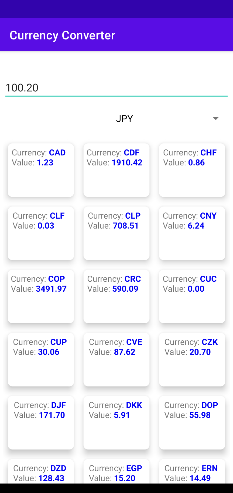

# CurrencyConverterApp
- This app allows a user view exchange rates for a given currency

## Functionality at a glance
-  Exchange rates are fetched from https://currencylayer.com/documentation
-  User can select a currency from a list of currencies provided by the API
-  User can enter desired amount for selected currency
-  User will then see a list of exchange rates for the selected currency
-  Rates are persisted locally and refreshed no more frequently than every 30 minutes 

## Architecture Details
- Based on MVVM with Clean Architecture
- Room DB for database
- Retrofit for network calls

## Future Improvements
- Add more unit tests
- Handle for case when first time app is opened and there is no internet
- Introduce Dependency injection
- Introduce Pull to refresh UX pattern
- Adding more logs
- Error handling in general
- Adding more comments in code
### UI Improvements
- Associate flag with currency code 
- Currency names to be displayed in grid view items
- Favourite currencies to be displayed on top of grid view

## Screenshots

